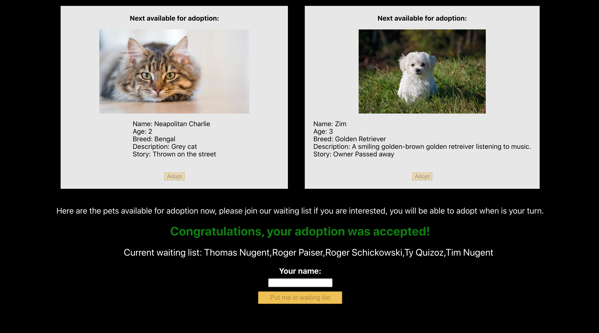

# Petful Client

Live Deployment

[https://petful-client-tawny.vercel.app/](https://petful-client-tawny.vercel.app/)

## Application Summary

Petful is an application which allows users to get in line to adopt a dog or cat. After they enter the queue to adopt, the queue progresses until they are at the head. Once the user is first in the queue, other people file in behind them until there are 5 people in line. At this time, the user can choose to adopt the currently available cat or dog. Once they choose, that animal is removed from the queue and replaced with the next in line, and the user is removed from the queue. At this point they can choose to get back in the queue if they so desire.

## Technology used

### Frontend

- ReactJS
- React Router
- HTML
- CSS
- Webpack
- Deployed at Vercel

### Backend

- RESTful API
- Node & Express
- Deployed Heroku

